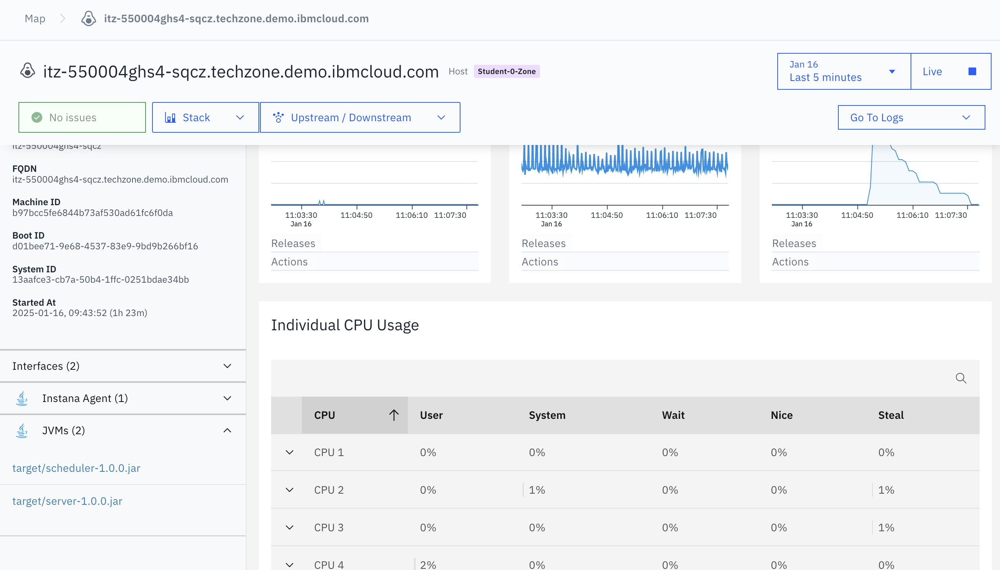
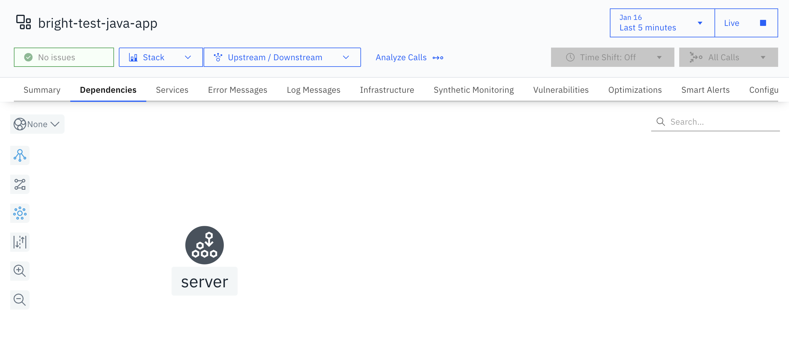
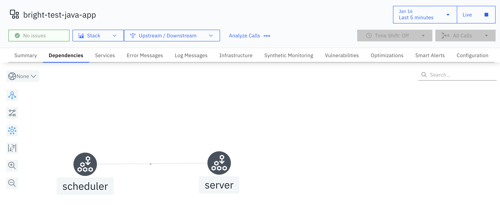
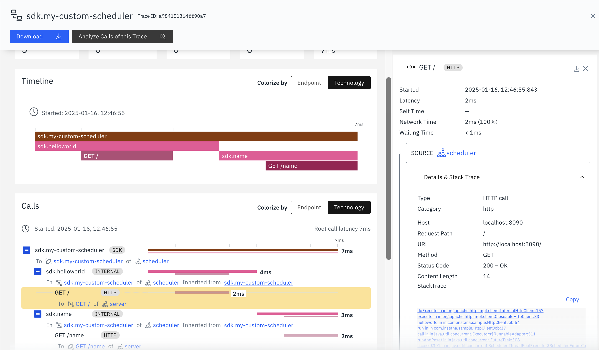
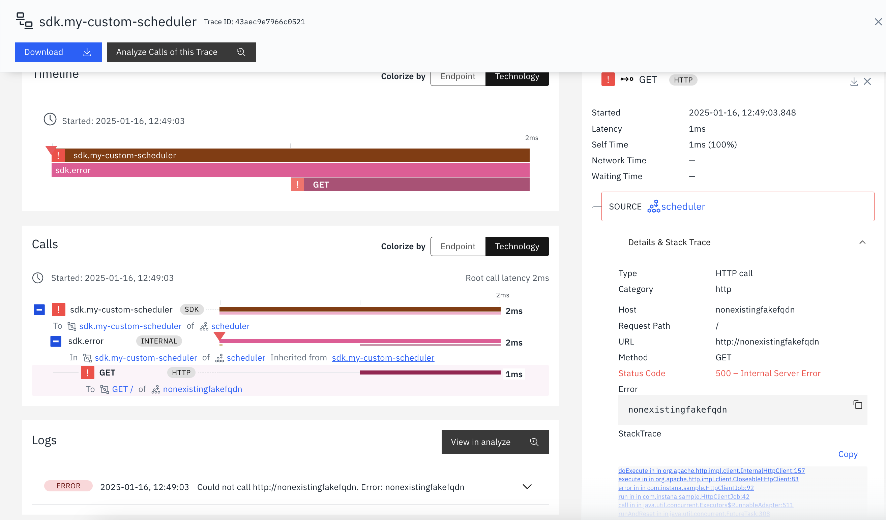
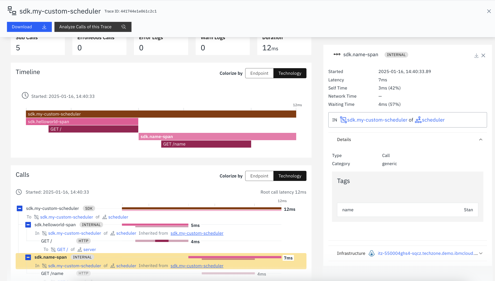

# Instana Tips

## Zone

```sh
INSTANA_ZONE="Student-0-Zone" && \
cat <<EOF | sudo tee /opt/instana/agent/etc/instana/configuration-zone.yaml
# Hardware & Zone
com.instana.plugin.generic.hardware:
  enabled: true
  availability-zone: "${INSTANA_ZONE}"
EOF
```

## Why `scheduler` component is not traced?

Both processes will be automatically discovered and monitored:


However, the tracing starts from `server` component, instead of `scheduler`, the client:


Why? As per the official doc [here](https://www.ibm.com/docs/en/instana-observability/current?topic=references-tutorial-instrumenting-custom-scheduler-instana-tracing-sdk):

```
The reason is that Instana instruments outgoing calls only if they happen in an existing trace context.
In the example, the outgoing call is triggered by the custom scheduler which is not instrumented.
Therefore, the call is not instrumented because no existing trace context is found.
```

## How to start tracing from `scheduler`?

Two approaches: by SDK programmatically or configuration.

### By SDK Programmatically

You may refer to [HttpClientJob.java.instrumented](./scheduler/src/main/java/com/instana/sample/HttpClientJob.java.instrumented).

Some changes have been made. For example:

```java

  // 1. Declare the span
  @Span(type = Span.Type.ENTRY, value = SPAN_NAME)
  public void run() {
    ...
  }

  // 1. Declare the span, which becomes Intermediate span by default if no type is specified
  @Span(value = "helloworld")
  public void helloworld() {
    // 2. Optionally, enhance the tracing context
    SpanSupport.annotate("tags.batch.job", "helloworld job");

    CloseableHttpClient httpClient = HttpClients.createDefault();
    HttpUriRequest request = new HttpGet("http://localhost:8090/");
    try (CloseableHttpResponse response = httpClient.execute(request)) {
      BufferedReader reader = new BufferedReader(new InputStreamReader(response.getEntity().getContent()));
      String result = reader.readLine();
      logger.info("Received " + response.getStatusLine() + " with body: " + result);
    } catch (Exception e) {
      // 3. Optionally, mark the span as error is error occurred
      SpanSupport.annotate("tags.error", "true");
      logger.error("Could not call " + request.getURI() + ". Error: " + e.getMessage());
    }
  }
  ...
```

You may restart the apps by:

```sh
# Stop the apps if they're running
./stop.sh

# Start the apps with Instana instrumentation
./start-with-instrumentation.sh
```

To take effect, we need to tell the Instana agent what packages to scan:

```sh
cat <<EOF | sudo tee /opt/instana/agent/etc/instana/configuration-javatrace.yaml
com.instana.plugin.javatrace:
  instrumentation:
    sdk:
      packages:
        - 'com.instana.sample'
EOF
```

> Note: Instana agent will hot reload `configuration-*.yaml` without a need to restart.

After that, you will see the end-to-end tracing, starting from the scheduler:


As we randomly call different endpoints where there is one erroneous call intentionally, we can see this different tracing results.

Normal trace:



Erroneous trace:




### By Configuration-based SDK

But wait, you may ask: **can I achieve this without code changes?**

Fortunately, the answer is **yes** in Instana, by applying the so-called ["configuration-based SDK"](https://www.ibm.com/docs/en/instana-observability/current?topic=references-configuration-based-java-trace-sdk).

Let's restart our apps but this time, we just run "original" code, without any changes:

```sh
# Stop the apps if they're running
./stop.sh

# Start the apps without any Instana instrumentation
./start.sh
```

Let's slightly update the Instana agent config -- remember it will be hot reloaded:

```sh
cat <<EOF | sudo tee /opt/instana/agent/etc/instana/configuration-javatrace.yaml
com.instana.plugin.javatrace:
  instrumentation:
    sdk:
      targets:
        - match:
            type: class
            name: com.instana.sample.HttpClientJob
            method: run
          span:
            name: my-custom-scheduler
            type: ENTRY
        - match:
            type: class
            name: com.instana.sample.HttpClientJob
            method: helloworld
          span:
            name: helloworld-span
            type: INTERMEDIATE
        - match:
            type: class
            name: com.instana.sample.HttpClientJob
            method: name
          span:
            name: name-span
            type: INTERMEDIATE
            tags:
              - kind: return
                name: name
        - match:
            type: class
            name: com.instana.sample.HttpClientJob
            method: error
          span:
            name: error-span
            type: INTERMEDIATE
            tags:
              - kind: argument
                name: url
                index: 0
EOF
```

By doing so, you will see the similar tracing outcomes, but without code changes.


